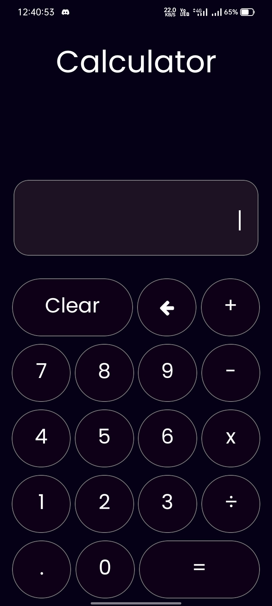
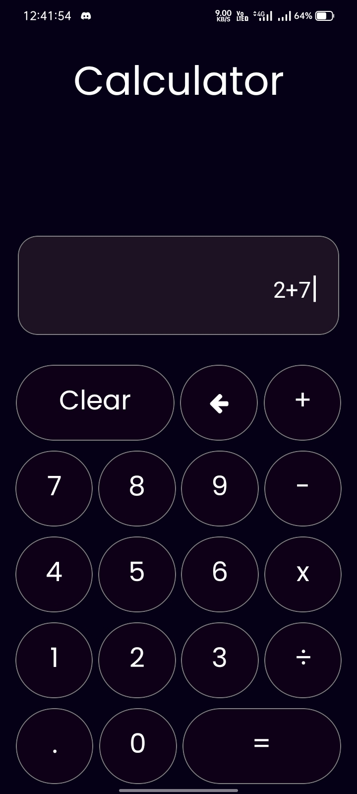
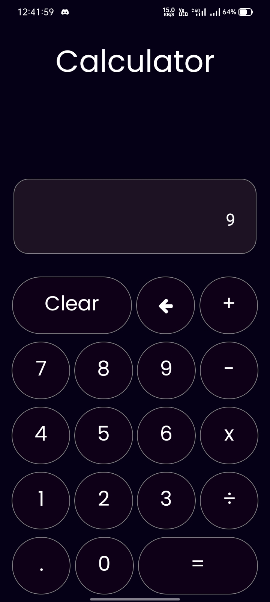

# Arithmetic Calculator
## Description:
A calculator capable of performing basic arithmetic operations, including addition, subtraction, multiplication, and division, with both whole numbers and decimal numbers.

### Key Features:

- Intuitive and easy-to-use layout with clear buttons for numbers and operations.
- Separate buttons for clearing the current entry and clearing all entries.
- Handles both whole numbers and decimal numbers accurately.

### Sample pictures

  
  
  

#### Packages used
- expo cli
- mathjs
- react native vector icons
- expo fonts
